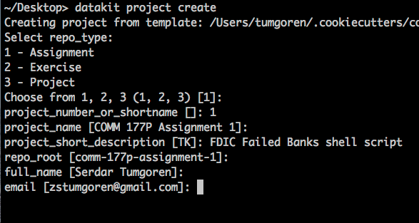
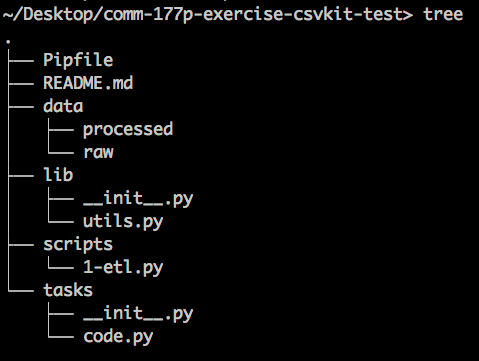
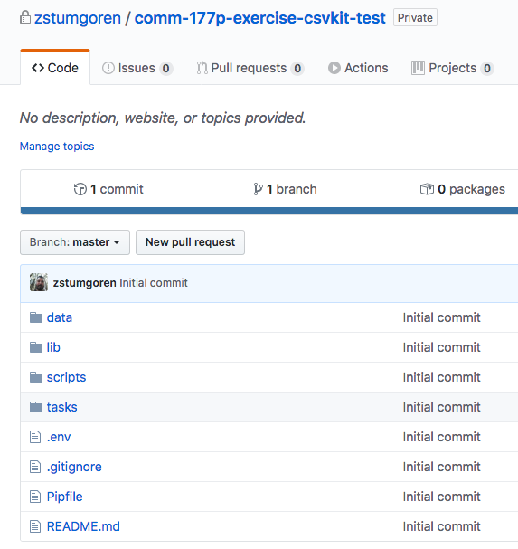

# Automating workflow with DataKit

In this course we'll dip into the culture of [newsroom automation](automating_workflows.md) by using [DataKit][], an open-source command-line tool created by The Associated Press. DataKit was designed in a team environment to bring sanity to data projects. Among other things, it helps standardize project structures, easily share code and data with teammates, and even publish data as part of story packages.

[DataKit]: https://datakit.ap.org/

It also makes it easy to customize workflows to suit different teams and individuals. We've customized DataKit for use in the classroom.

DataKit will help us streamline our workflow while applying best practices from the worlds of data science and software. Among other things, it will help us:

* Create standard project structures for all code work
* Use virtual environments for Python
* Save code and data in version control (git)
* Publish our work to GitHub, making it easy to open-source if we choose
* Easily share our work with instructors

See [here](https://github.com/stanfordjournalism/cookiecutter-stanford-progj) for more details on our classroom workflow and customizations.


## Install

Follow the steps in [Tech Setup - DataKit](tech_setup.md#datakit). *Note, you must first work through the preceding steps in the Technical Setup.*

## Preview

When you run DataKit on the command line, it will ask you a series of questions that help configure the new project. The questions will often have default values shown in square brackets `[]`. 

You can simply hit `return` to accept the defaults, or type in an answer as necessary. Below is a **truncated** example session showing the initial questions and default values.

You can see below that we entered "1" for the project number and "FDIC Failed Banks shell script" for the project short description. Otherwise, we accepted the default values.



After the initial configuration above, you'll be prompted to decide a few other things, such as whether to make the project private or public on GitHub (we'll generally make our projects private, although you have the option to later make them public).

Once the script finishes running, you should see output on the shell such as below


Some important bits to note:

* A new git repository has been created on your local machine: `comm-177p-exercise-csvkit-test/`
* A corresponding GitHub project has been created, in this example, at `https://github.com/zstumgoren/comm-177p-exercise-csvkit-test`). This GitHub project is linked to the newly created *local* repository, so that you can easily push local changes back to GitHub.

If you look inside the new local repo, you should see that a bunch of initial project files and directories have been created for you.



If you visit the GitHub project, you would see that these files have been saved to GitHub as well.



Finally, the project includes a `README.md` that contains reminders on daily workflow (discussed in more detail below).

You should now have a high-level sense of what DataKit does. In the next section, we'll use DataKit to create our first project.

## First project

The first time you run DataKit will be a little bit different than subsequent uses. On this first run, we need to specify a [template on GitHub](https://github.com/stanfordjournalism/cookiecutter-stanford-progj) that we'll use to auto-generate our projects. This template contains the boilerplate files common to all projects. It helps us streamline the process of generating a standardized project structure.

When you first run DataKit, it will install this template locally, simplifying future usage.

As a first project, let's assume you've created a [data processing script using csvkit](power_tools_for_data_wrangling.md#wrangling-with-csvkit).

Execute the following command and answer the questions as specified below:

* Choose `2 - Exercise` as "repo_type" 
* Type `csvkit` for "project\_number\_or\_shortname" 
* For all other prompts, hit `return` to accept default values

```
datakit project create --template gh:stanfordjournalism/cookiecutter-stanford-progj
```

As mentioned above, the shell will display the URL for the auto-generated GitHub project. It will also notify you about next steps, which involve navigating into the newly created repository on your shell and installing some Python libraries.

```
# Navigate to the newly created project folder
cd comm-177p-exercise-csvkit/

# Install Python dependencies
pipenv install

# Copy your csvkit code to the new project
# NOTE: Substitute the actual path to csv_wrangle.sh on your machine
cp /path/to/csvkit_wrangle.sh scripts/csvkit_wrangle.sh

# Activate a sandboxed environment for this project
pipenv shell

# Save your work locally
invoke code.save

# Push work to GitHub
invoke code.push

# When you're done working,
# deactivate the virtual environment
exit
```

Congratulations, your work should now be saved in a private repo on GitHub!!

## Day-to-day with DataKit

In the future, you can use DataKit to create new projects by simply running `datakit project create`, followed by the other commands mentioned above.

You should get into the habit of saving and publishing your work to GitHub whenever you add, change or delete files. This applies to both code and data files.

If you're making changes to a previously created project, you won't need all of the commands mentioned above. 

Here's the short list of commands you'll need when working with an existing project:

> Note: Every project's `README.md` includes reminders on this workflow.

```
# Navigate to the project folder
cd comm-177p-exercise-csvkit/

# Activate a sandboxed environment for this project
pipenv shell

# Save your work locally
invoke code.save

# Push work to GitHub
invoke code.push

# When you're done working,
# deactivate the virtual environment
exit
```