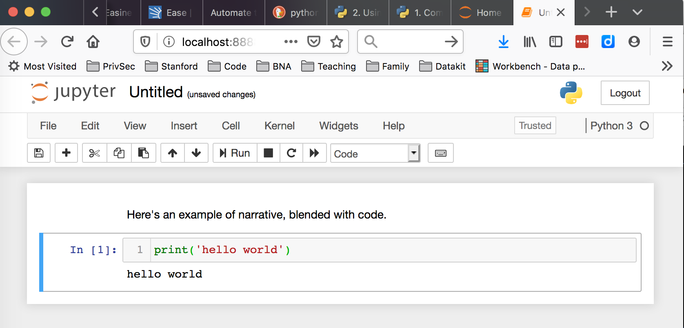

# Python Overview

- [Intro](#intro)
- [What is Python?](#what-is-python)
- [Coding contexts](#coding-contents)
  - [Python interactive interpreter](#python-interactive-interpreter)
  - [Python scripts](#python-scripts)
  - [Jupyter notebooks](#jupyter-notebooks)


## Intro

Python is a general-purpose programming language, meaning that it's useful for a variety of tasks. Python is far from the only language used in newsrooms, but it *is* one of the most common because it's so versatile and relatively easy to learn.

Newsrooms use Python in countless ways:

* Scraping data from government websites
* Mining documents
* Accessing data in APIs 
* Building data-driven web applications
* Automating workflows
* Provisioning servers in the cloud
* Generating automated news content
* Creating data gathering web admins
* Analyzing satellite imagery
* Visualizing data

...the list goes on and on.

## What is Python?

But what, precisely, is Python? Here's how it's definited in [Automate the Boring Stuff](https://automatetheboringstuff.com/2e/chapter0/):

> Python is a programming language (with syntax rules for writing what is considered valid Python code) and the Python interpreter software that reads source code (written in the Python language) and performs its instructions.

Pretty concise but still fairly abstract. Let's explore that definition with a simple example.

Open a Terminal, type the following and hit `return`:

```
python -c "print('hello world')"
```

Congratulations! You've just used both the Python *interpreter* and the Python *language*! 

Above, the `print('hello world')` portion of code represents one small bit of the Python programming language. On its own, this bit of code won't do anything. We need to use the [Python interpreter](https://docs.python.org/3/tutorial/interpreter.html) to...well...interpret and execute this bit of source code. We did this by passing the Python command -- in this case a simple [print](https://docs.python.org/3.5/library/functions.html#print) statement -- to the Python interpreter. 

> The `-c` flag allows us to pass commands to the Python interpreter directly on the command line.

Yes, this is a very basic example. But it highlights an important point: 

**When we write code, we're creating instructions for a machine to interpret and execute. We need both pieces of the puzzle -- the instructions and the interpreter -- to do real work.**

## Coding contexts 

Python programmers work in a variety of environments, or coding "contexts". The tools and workflow vary by coder and task.

In this course, we'll introduce you to a few common contexts for writing and executing code. Each of these tools and associated workflows have their own strengths, as detailed below. 

For this course, we'll draw clear lines between these tools. In particular, we'll focus on using traditional Python scripts for data acquisition while performing data transformation and analysis in [Jupyter][] notebooks.

This separation of concerns is subjective and the lines are often blurred in practice by data journalists. For example, it's common for data journalists to download CSVs or grab data from APIs in a Jupyter notebook. Similarly, they may perform sophisticated transformations and analyses directly in a script as part of a larger data processing pipeline.

Individual or team preferences as well as practical concerns (e.g. the complexity or size of data) often dictate where journalists draw these lines.

### Python interactive interpreter

The Python interpreter can be run in an [interactive mode](https://docs.python.org/3/tutorial/interpreter.html#interactive-mode) on the command line by simply typing `python`.

This interactive environment allows you to write code and execute it in real time. It's a great tool for experimenting with Python syntax and libraries during active development of a larger script or library.

```
~> python
Python 3.7.0 (default, Jun  7 2019, 14:35:44)
[Clang 9.1.0 (clang-902.0.39.2)] on darwin
Type "help", "copyright", "credits" or "license" for more information.
>>> 2 + 2
4
>>> print('hello world')
hello world
>>> exit()
~>
```

### Python scripts

Python scripts are static text files with a `.py` extension that contain Python code. These files are created using a code editor such as Visual Studio Code. 

Similar to bash shell scripts, they are typically run from the [command line](https://docs.python.org/3/using/cmdline.html#command-line) and are quite handy for peforming automated tasks such as scraping a web site and updating a database. 

A script by itself is just Python code in a text file. You must pass the script to the Python interpreter in order to execute the code.

```
# Create a toy python script
~> echo "print('hello world')" > myscript.py

# See the script contents
~> cat myscript.py
print('hello world')

# Run the script
~> python myscript.py
hello world
~>
```


### Jupyter notebooks

[Jupyter][] is an interactive Python environment that runs in a web browser. Data journalists use Jupyter to create human-friendly notebooks that blend narrative explanations of their work with actual, working code.



[Jupyter]: https://jupyter.org/
