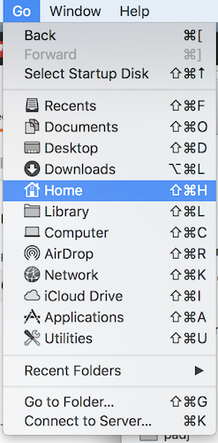
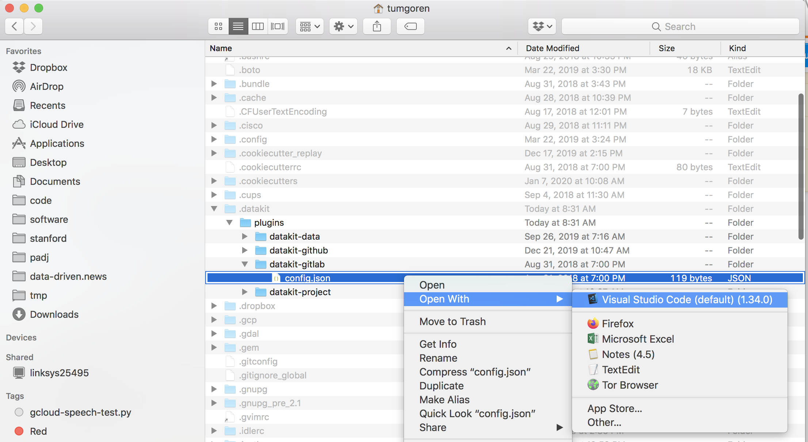

# Technical FAQs

### Why won't X install on Mac Catalina?

Some students reported warnings about "malicious" software when trying to install VSCode or Atom code editors on Mac Catalina.

This [StackOverflow post](https://stackoverflow.com/questions/58457958/visual-studio-code-cant-be-opened-because-apple-cannot-check-it-for-malicious) has a temporary work-around. Probably worth trying the simpler solution first (`System Preferences > Security & Privacy`).

### Why are basic shell commands missing on Mac Catalina?

Mac users who have upgraded to Catalina reported that they don't have basic shell utilities such as `ls`, `cp`, etc. in the Terminal.

Running `xcode-select --install` appears to fix the problem.

> Note: This is one of the steps you need to run in our [technical setup](tech_setup.md), so please make sure to only run it once.

### Which Ubuntu should I use? 

Typically, you'll want the latest "LTS" release from the [Ubuntu download page](https://ubuntu.com/download/desktop).

### How do I edit hidden files on a Mac?

Mac and Linux systems contain hidden files and directories that typically contain configuratons for various programs on the system. An example is `~/.bashrc`, which contains configurations for the bash shell.

These files can be opened and edited with a standard code editor such as Visual Studio Code or Atom. 

> For this example, we assume you have Visual Studio Code installed.

In order to edit such files, you should open a Finder window.

Hit `command` + `shift` + `.` to make invisible files and folders appear in the Finder.

Use the Finder menu to navigate to your Home directory using `Go -> Home`.

You show now see your home directory, which contains a number of hidden files and directories starting with a `.`. For this example, let's assume we want to edit a hidden configuration file for DataKit.

Navigate to the `~/.datakit/plugins/datakit-github` folder.

Right-click on `config.json`.

You should get a pop-up menu with options for opening the file using different programs.

Choose `Open With` and select a code editor such as Visual Studio Code or Atom to open and edit the file.

If you wish to once again hide these `.`-prefixed files and directories, hit `command` + `shift` + `.` once again in the Finder window.